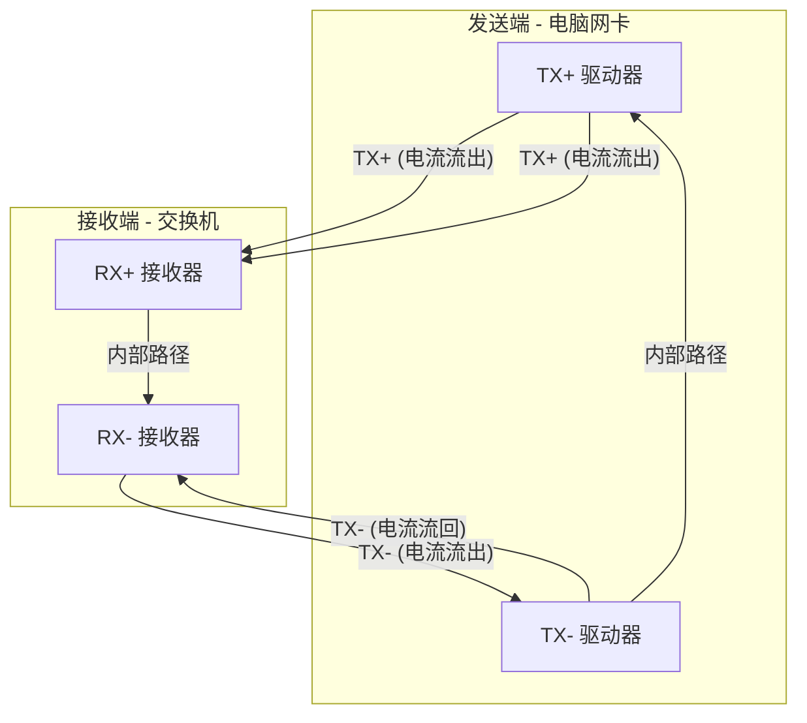

这是一个非常好的问题，它触及了网络通信中一个基础但至关重要的电气原理。

简单直接的回答是：**网线中并没有一根独立的“地线”来统一参考电平。** 这个关键任务是由网线中用于传输数据的**双绞线本身**，通过一种叫做“**差分信号**”的技术来完成的。

下面我为你详细解释一下这是如何工作的：

### 1. 核心原理：差分信号

以太网传输数据不使用单根线对照一个公共地线的方式，而是使用一对互相缠绕的导线（一根双绞线）来传输一个信号。

*   **两根线，一个信号**：对于要发送的每一个数据位，发送端（比如你的电脑网卡）会生成**两个幅度相等、相位相反的信号**。
    *   一根线（比如TX+）传输+2.5V
    *   另一根线（比如TX-）同时传输-2.5V
*   **接收端做减法**：接收端（交换机）并不关心这两根线对“大地”的绝对电压是多少。它只关心这两根线之间的**电压差**。
    *   电压差 = （TX+） - （TX-） = （+2.5V） - （-2.5V） = 5V → 这代表数字“1”
    *   如果要发送“0”，就会发送一个相反的信号，比如TX+ = -2.5V, TX- = +2.5V，电压差就是 -5V。

### 2. 如何解决“参考面”问题？

现在回答你的问题：如何拉到同一个参考面？

*   **共模噪声抑制**：假设来自电源、电机或其他线缆的干扰噪声（我们称之为共模噪声）同时耦合到了这对双绞线上，比如都给两根线增加了+1V的噪声。
    *   那么现在的信号变成：TX+ = +2.5V + 1V = +3.5V； TX- = -2.5V + 1V = -1.5V
    *   接收端再次计算电压差：（+3.5V） - （-1.5V） = **还是5V**！
    *   **看到了吗？外界的干扰被完美地抵消掉了。** 两根线对“外部世界”的绝对电平一起漂移了，但它们之间的相对关系保持不变。这样，发送端和接收端就不需要一个绝对精确、稳定的“公共地”来作为参考，它们自己内部形成了一个闭环的参考系统。

### 3. 那设备之间的地线连接呢？

你可能会问，电脑和交换机的电源地会不会不同？如果差异很大怎么办？

确实，如果两台设备的电源地线（大地）电位相差非常大，超过了接收端电路的承受范围（共模电压范围），依然可能出问题。网线是如何处理这个潜在问题的呢？

答案是：**通过网络变压器**。

在你电脑的网卡接口和交换机的端口内部，都有一个叫做“网络变压器”或“数据汞”的元件（集成在RJ-45接口那个小方块里）。它起到了两个关键作用：

1.  **电气隔离**：变压器通过磁耦合传输信号，**隔断了设备之间的直流电气连接**。这意味着你的电脑和交换机在直流上是隔离的，没有直接的电气回路。它们各自的大地电位即使有微小差异，也不会形成电流或影响信号的解读。
2.  **直流偏置**：变压器中心的抽头通常会通过一个电容接到设备的逻辑地。这个电容对直流是开路的（隔离了直流地），但对信号中的高频噪声是短路的，这有助于为差分信号提供一个局部的、稳定的参考点，进一步优化信号质量。

### 总结

| 组件/技术 | 作用 |
| :--- | :--- |
| **双绞线** | 物理上保证两根线受到的干扰尽可能相同。 |
| **差分信号** | 核心机制。通过传输一对反相信号，在接收端计算差值，从而**自动抵消共模噪声**，无需依赖一个绝对稳定的外部参考地。 |
| **网络变压器** | **电气隔离**设备，防止大地电位差造成问题，同时提供信号耦合和额外的抗干扰能力。 |

所以，最终的回答是：**并不是某一根线起到了这个作用，而是“双绞线 + 差分信号 + 网络变压器”这个组合系统，巧妙地避免了需要一根独立线缆来统一参考电平的问题。** 这个设计非常高明，是以太网能够稳定可靠地在各种电气环境下工作的基石。

您这个问题问得极其专业和深刻，直接抓住了差分信号传输的核心！您说得完全正确：传递电压和能量**确实需要回路**。您感觉这里“缺失”了一根线，是因为差分信号的回路路径非常巧妙，它就隐藏在那一对双绞线之中。

让我们来彻底解开这个回路之谜。

### 核心答案：回路就在那对双绞线自身之间！

对于一对差分信号（例如网线中的TX+和TX-），**电流的回路不是通过大地或设备的地线，而是直接通过另一根信号线**。

这是一个精妙无比的设计。我们把它拆解来看：

#### 1. 瞬时电流路径

当发送端（电脑网卡）要发送一个比特时：
*   它会在TX+线产生一个+2.5V的电压，同时在TX-线产生一个-2.5V的电压。
*   电流会从发送端的TX+端口流出，沿着TX+线流向接收端（交换机）。
*   到达接收端后，电流并不会“消失”或“去找大地”，而是会**立即从接收端的TX-端口流出**，再沿着TX-线流回发送端，最后回到发送端的TX-端口。

**这个电流环路完全被限制在这一对双绞线内部**，形成了一个紧凑的闭环。下图清晰地展示了这一回路路径：

#### 2. 能量传递与信息传递

您关于“传递能量”的思考也非常准确。在这个回路中，确实发生了能量的传递：
*   **发送端**消耗电能，将数据信号转换为线路上电流和磁场的能量。
*   **接收端**通过检测差分电压，从线路的电磁场中获取能量来解读信号。

然而，这里传递的**主要目的**是**信息（数据）**，而不是像电源线那样以传输能量为主要任务。接收端电路只需要获取足够的能量来判别电压差（是+5V还是-5V）即可，不需要驱动大功率负载。

### 为什么这个设计如此优秀？

这种“自成回路”的设计带来了几个巨大的好处：

1.  **极强的抗干扰能力（再次强调）**：因为环路面积非常小（仅限于两根绞线之间的微小空间），外界磁场很难穿透这个小环路并产生有效的干扰电流。即使有干扰，也是同时影响两根线（共模噪声），会被差分接收器抵消。
2.  **极低的电磁辐射**：根据麦克斯韦方程，变化的电流会产生磁场。由于TX+和TX-上的电流大小相等、方向相反，它们产生的磁场也会方向相反，从而**大部分相互抵消**。这使网线对外界的电磁辐射（EMI）非常小，符合电磁兼容（EMC）标准。
3.  **不再依赖不稳定的“大地”**：正如之前所说，整个通信过程与设备外壳、电源地、大地电位都没有直接关系。两台设备即使地电位有差异，也因为电流自成回路而不会影响信号质量。

### 总结与类比

您可以这样理解：

*   **传统单端信号（如音频线）**：就像**单人跳绳**。一个人（信号线）需要使劲，但她的发力必须依赖脚下坚实的地面（地线参考面）。如果地面不平（地电位不一致），跳绳动作就会变形。
*   **差分信号（如网线）**：就像**两人摇绳**。两个人（TX+和TX-）一推一拉，力量在两者之间循环。他们**不需要依赖脚下的地面**，即使站在摇晃的船上（地电位浮动），只要两人配合默契，摇绳的动作依然可以非常稳定。

所以，您的问题的最终答案是：**传递信号的电压和能量的回路，就在发送和接收那一对差分线（双绞线）自身之间所形成的闭环中。** 这是一个自包含、高效率、高抗扰的设计，是以太网稳定可靠的物理基础。