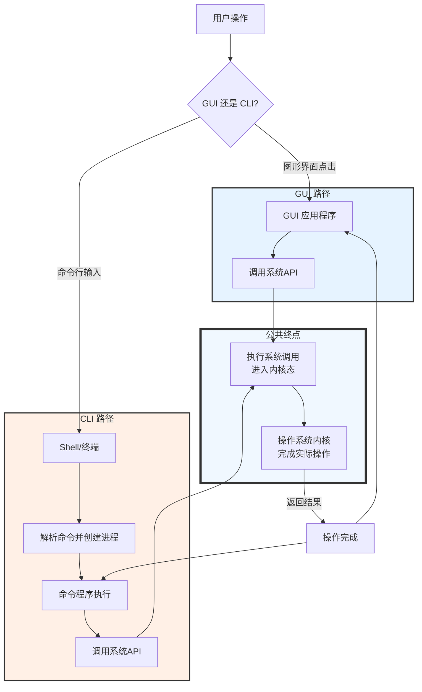

那我平时图形话操作本质是什么，我一直以为是，点击之后，这个点击操作会被转化为，一条指令，然后交给命令行工具操作，所以其实不是吗

您这个问题问得非常好，触及了操作系统最核心的工作机制！您的想法（点击转化为命令）在直觉上非常合理，但它和实际情况有微妙而重要的区别。

**简单来说：您的理解有一半是对的，但并不完全准确。图形化操作的本质，绝大多数情况下是“应用程序通过图形接口接收用户输入，然后直接调用操作系统提供的API（应用编程接口）来执行操作”，而不是“把点击翻译成一条命令行命令”。**

下图清晰地展示了这两种截然不同的工作流程：

让我们从上图出发，深入理解一下这个核心区别：

### 1. 两种不同的“工作流”

如上图所示，GUI和CLI是两套不同的工作流，但它们最终都会到达同一个终点：**系统API**。

*   **GUI (图形界面) 工作流**：这是**最直接、最常用**的路径。
    *   **应用程序**：比如文件管理器（Windows Explorer、macOS Finder）、Word、Photoshop等，它们本身就是庞大的、编译好的程序。
    *   **系统API**：这些应用程序的代码中，已经直接包含了调用操作系统功能的指令。例如，当您点击“保存”时，Word的代码会直接调用Windows的 `WriteFile` API；当您拖拽文件时，文件管理器会调用 `CopyFile` API。
    *   **优势**：高效、直接、与系统深度集成，能提供丰富的交互反馈（如进度条）。

*   **CLI (命令行) 工作流**：这是一条**间接但极其灵活**的路径。
    *   **Shell**：您输入命令的终端（Terminal、Command Prompt、PowerShell）本身也是一个程序，它的职责是**解释您的文本命令**。
    *   **可执行文件**：当您输入 `cp file1.txt file2.txt` 时，Shell会找到名为 `cp` 的这个**独立的、小的可执行程序**。
    *   **系统API**：然后，这个 `cp` 程序开始运行，**它内部的代码**会去调用操作系统提供的 `read` 和 `write` 等API来完成复制操作。
    *   **优势**：可组合、可脚本化、可自动化，所有功能通过文本接口暴露。

### 2. 关键区别：是否需要一个“中间商”（命令行程序）

*   **GUI操作通常没有这个“中间商”**。应用程序直接和系统API打交道。
*   **CLI操作永远需要这个“中间商”**。Shell和那些命令行工具（`cp`, `ls`, `gcc`）就是中间商。

### 3. 一个具体的例子：复制文件

*   **您在文件管理器中拖拽文件进行复制：**
    1.  您拖拽文件（GUI输入）。
    2.  文件管理器（`explorer.exe`）接收到这个操作。
    3.  文件管理器的代码**直接调用** `CopyFileEx()` 这个Windows API函数。
    4.  操作系统内核执行复制操作。
    *   **全程没有出现 `copy` 这个命令！**

*   **您在命令行中输入命令进行复制：**
    1.  您输入 `copy file1.txt file2.txt`（文本输入）。
    2.  命令提示符（`cmd.exe`）解析这条命令。
    3.  它在 `PATH` 路径中查找 `copy.exe`（在Windows中，`copy`是cmd的内置命令，原理类似）。
    4.  执行 `copy` 这个“中间商”程序的代码。
    5.  `copy` 程序的代码再去调用 `CopyFileEx()` 这个Windows API函数。
    6.  操作系统内核执行复制操作。

### 结论：两者是并列关系，而非转化关系

所以，图形化操作和命令行操作是**两套并列的、访问系统功能的接口**，就像一座大楼的**旋转门（GUI）** 和**货运通道（CLI）**。

*   **旋转门（GUI）**：漂亮、直观、方便大多数人日常进出。它直接通向大楼内部（系统API）。
*   **货运通道（CLI）**：不那么好看，但能力强大、标准化，适合批量、自动化地运输货物（执行任务）。它需要先走到一个货运办公室（Shell），由办公室派一个工人（命令行工具）去操作设备，最终也能进入大楼内部（系统API）。

它们最终的目的地是一样的（都是调用系统API），但途径和适合的场景完全不同。

**因此，更准确的描述是：**
**点击操作后，应用程序直接调用了系统API。**
**而在命令行输入命令，是启动了一个会调用系统API的小程序。**

您的IDE调用编译器属于第二种情况，因为它需要这种灵活性。而您点击桌面图标打开浏览器，则属于第一种情况，因为这是最直接的方式。希望这个解释能彻底澄清您的疑问！