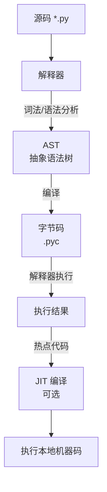

纯解释型语言（如 Python、JavaScript、Ruby、PHP）的“编译工具链”概念与传统编译型语言有**本质区别**。它们没有显式的“编译-链接”阶段，而是由**解释器（Interpreter）动态读取源码并执行**。不过，现代解释器内部普遍引入了**字节码编译**和**即时编译（JIT）** 优化，工具链的核心围绕**解释器引擎**及其**运行时环境**构建。以下是详细解析：

---

### 核心流程概览（以 Python 为例）

---

### 工具链关键组件详解

#### 一、**核心引擎：解释器**
1.  **解释器（Interpreter Core）**：
    *   **功能**：**逐行/逐块读取源码**，动态执行。核心包含：
        *   **词法分析器 (Lexer)**：将源码拆分为 Token（关键字、标识符、运算符等）。
        *   **语法分析器 (Parser)**：根据语法规则构建 **AST（抽象语法树）**。
        *   **编译器（Compiler）**（可选但普遍存在）：将 AST **编译为字节码**（非必须，但现代解释器几乎都这样做以提高性能）。
        *   **解释执行单元**：**遍历 AST 或执行字节码**，调用内置函数/操作。
    *   **代表实现**：
        *   **Python**: CPython（官方C实现）、PyPy（带JIT的Python）
        *   **JavaScript**: V8（Chrome/Node.js）、SpiderMonkey（Firefox）、JavaScriptCore（Safari）
        *   **Ruby**: CRuby（MRI）、JRuby（JVM）、TruffleRuby（GraalVM）
        *   **PHP**: Zend Engine（官方）、HHVM（Facebook）

#### 二、**字节码编译（普遍存在但非必须）**
2.  **字节码编译器（Bytecode Compiler）**：
    *   **功能**：将 AST **编译为紧凑的中间指令集（字节码）** 供解释器执行。字节码**不跨平台分发**，仅作为解释器内部优化。
    *   **输出**：
        *   **Python**: `.pyc` 文件（缓存字节码，加速后续加载）
        *   **PHP**: Opcodes（Zend引擎内部使用）
        *   **Ruby**: YARV 指令（CRuby 1.9+）
    *   **优点**：
        *   **减少重复解析开销**：源码→字节码只需一次，后续执行直接运行字节码。
        *   **指令更紧凑**：比源码更易快速解释执行。

#### 三、**即时编译（JIT）：性能加速器（非所有解释器具备）**
3.  **JIT 编译器（Just-In-Time Compiler）**：
    *   **功能**：在运行时将**热点字节码/函数**动态编译为**本地机器码**，后续直接执行机器码。
    *   **代表**：
        *   **JavaScript**: V8（Ignition 解释器 + TurboFan JIT）、SpiderMonkey（Baseline解释器 + IonMonkey JIT）
        *   **Python**: PyPy（RPython 编写的带JIT的Python解释器）
        *   **Ruby**: MJIT（CRuby 可选JIT）、TruffleRuby（Graal JIT）
        *   **PHP**: JIT in PHP 8+（集成于Zend引擎）
    *   **效果**：大幅提升计算密集型任务性能（可达C语言的1/3~1/10）。

#### 四、**依赖管理与包生态**
4.  **包管理器（Package Manager）**：
    *   **功能**：解决**库依赖**问题（纯解释型语言库通常也是源码或字节码）。
    *   **工具**：
        *   **Python**: `pip` + `PyPI`（仓库）
        *   **JavaScript**: `npm`/`yarn`/`pnpm` + npm registry
        *   **Ruby**: `gem` + RubyGems.org
        *   **PHP**: `composer` + Packagist
    *   **特点**：直接下载**源码或预生成字节码**，由本地解释器执行。

#### 五、**构建与执行工具**
5.  **运行时启动器**：
    *   **功能**：启动解释器并执行源码/脚本。
    *   **命令**：
        *   `python script.py`
        *   `node app.js`
        *   `ruby main.rb`
        *   `php index.php`
6.  **REPL（交互式环境）**：
    *   **功能**：实时输入代码片段并查看结果（用于调试、学习）。
    *   **工具**：`python`、`node`、`irb`（Ruby）、`php -a`。

#### 六、**调试与分析工具**
7.  **调试器（Debugger）**：
    *   **功能**：在源码级别设置断点、检查变量。
    *   **工具**：
        *   **Python**: `pdb`、IDE（PyCharm, VSCode）
        *   **JavaScript**: Chrome DevTools、`node inspect`
        *   **Ruby**: `byebug`、`pry`
        *   **PHP**: Xdebug + IDE
8.  **性能分析器（Profiler）**：
    *   **功能**：定位性能瓶颈（函数调用次数、耗时）。
    *   **工具**：
        *   **Python**: `cProfile`、`py-spy`
        *   **JavaScript**: Chrome DevTools Profiler、`0x`（Node.js）
        *   **Ruby**: `ruby-prof`、`stackprof`
        *   **PHP**: XHProf、Blackfire

---

### 语言实现差异对比

| 组件                 | Python (CPython)       | JavaScript (V8)        | Ruby (CRuby)           | PHP (Zend Engine)      |
|----------------------|------------------------|------------------------|------------------------|------------------------|
| **核心解释器**       | CPython 虚拟机         | V8 Ignition 解释器     | YARV 虚拟机            | Zend Executor          |
| **字节码格式**       | `.pyc` (Python bytecode)| 无持久化字节码         | YARV 指令              | Zend Opcodes           |
| **JIT 编译器**       | 无（官方CPython无JIT）| TurboFan (V8)          | MJIT (CRuby)           | JIT (PHP 8+)           |
| **内存管理**         | 引用计数 + GC          | 垃圾回收 (GC)          | 标记-清除 GC           | 引用计数 + 循环GC      |
| **包管理器**         | `pip`                  | `npm`/`yarn`           | `gem`                  | `composer`             |
| **REPL**             | `python`               | `node`                 | `irb`                  | `php -a`               |
| **高性能替代实现**   | PyPy (带JIT)           | 所有引擎均含JIT        | TruffleRuby (Graal JIT)| HHVM (JIT/AOT)         |

---

### 关键特点总结

1.  **无显式编译阶段**：
    *   用户直接运行源码文件（如 `python app.py`）。
    *   开发者无需处理“编译错误”，只有运行时错误。

2.  **启动速度快，但执行慢**：
    *   **优势**：适合脚本、快速原型开发。
    *   **劣势**：计算密集型任务性能远低于编译型语言（除非有JIT）。

3.  **动态类型与运行时灵活性**：
    *   变量类型在运行时确定，支持反射、动态修改对象。
    *   灵活但易引发运行时错误（需单元测试覆盖）。

4.  **跨平台由解释器保证**：
    *   同一份源码在任何装有**兼容解释器**的平台上运行。
    *   但需注意解释器版本差异（如 Python 2 vs 3）。

5.  **部署简单性**：
    *   分发源码（或字节码缓存 `.pyc`）。
    *   但需确保目标环境有**正确版本的解释器及依赖库**。

6.  **安全性依赖解释器沙箱**：
    *   解释器提供基础内存安全（数组越界等抛出异常而非崩溃）。
    *   但动态特性易引发代码注入风险（如 `eval()`）。

---

### 典型工作流示例：Python (CPython)

> **注**：若使用 **PyPy**（带JIT的Python），在虚拟机执行阶段会对热点代码触发JIT编译，转换为机器码执行。

---

### 总结
纯解释型语言（Python、JS、Ruby、PHP）的“工具链”本质是**围绕解释器引擎构建的运行时环境**：

1.  **核心**：解释器（含词法分析、语法分析、字节码编译/执行单元）。
2.  **性能加速**：普遍通过字节码缓存 + 部分语言支持JIT（如JS/V8、PHP 8+、PyPy）。
3.  **开发生态**：包管理器（`pip`/`npm`/`gem`/`composer`） + REPL + 调试器。
4.  **部署**：源码 + 解释器 + 依赖库。

与传统编译工具链的最大区别在于：**无机器码生成阶段，执行完全依赖解释器动态处理源码或内部字节码**。现代解释器虽引入JIT模糊了界限，但其设计初衷仍是**牺牲执行效率换取开发灵活性与跨平台便捷性**。