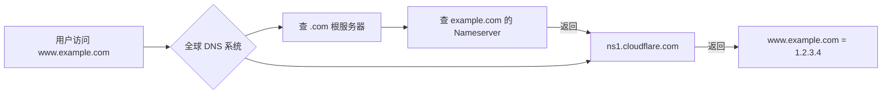

这是个非常棒的问题！  
**“为什么域名还有更改 DNS 服务器的选项？”** —— 其实这正是域名系统（DNS）**灵活、解耦、可扩展**的核心设计！

我们来一步步拆解，让你彻底明白这个“看似多余”的功能到底有什么用。

---

##  一、先搞清楚两个概念：**域名注册商 ≠ DNS 托管商**

很多人以为：
> “我在腾讯云买了域名，那解析（比如把 `www.example.com` 指向我的网站 IP）当然也得用腾讯云。”

但其实——**这两件事完全可以分开！**

| 功能 | 谁负责？ | 举例 |
|------|--------|------|
| **1. 域名注册** | 注册商（Registrar）（如腾讯云、阿里云） | 确保 `example.com` 是你的，能续费、转出 |
| **2. DNS 解析** | DNS 托管服务商（DNS Hosting） | 把 `www.example.com` → `1.2.3.4` |

 **你可以：**
- 在 **腾讯云买域名**，
- 但把 DNS 解析交给 **Cloudflare、阿里云 DNS、华为云、自建 DNS 服务器** 等任何你信任的服务。

这就是 **“更改 DNS 服务器”** 的意义！

---

##  二、什么是“DNS 服务器”（Nameserver）？

当你在浏览器输入 `www.example.com`，电脑需要知道它对应的 IP 地址（比如 `1.2.3.4`）。  
这个“翻译”工作由 **DNS 服务器**完成。

而 **域名本身要告诉全世界：“去哪找我的 DNS 记录？”**  
答案就写在 **Nameserver（NS 记录）** 里。

例如：
```text
example.com 的 Nameserver 设置为：
  ns1.cloudflare.com
  ns2.cloudflare.com
```
→ 这表示：**所有关于 example.com 的解析请求，请去问 Cloudflare！**

>  关键点：  
> **Nameserver 决定了“谁来提供 DNS 解析服务”**，而不是“谁卖你域名”。

---

##  三、为什么要改 DNS 服务器？（实际用途）

###  场景 1：用更强大的 DNS 服务
- 腾讯云免费 DNS 功能简单；
- 你想用 **Cloudflare** 的全球加速、DDoS 防护、CDN 集成；
- → 只需把 Nameserver 改成 Cloudflare 提供的那两个地址即可。

###  场景 2：统一管理多个域名
- 你在腾讯云、阿里云、GoDaddy 各买了一个域名；
- 但希望**全部在 Cloudflare 里集中管理 DNS**；
- → 分别把每个域名的 Nameserver 都改成 Cloudflare 的就行。

###  场景 3：企业自建 DNS
- 大公司可能有自己的 DNS 服务器（如 `ns1.yourcompany.com`）；
- 为了安全或内网解析需求，直接指定自己的 NS。

###  场景 4：迁移网站/服务时无缝切换
- 旧服务器用 A 记录指向 IP1；
- 新服务器准备就绪后，在新 DNS 服务商配好记录；
- 切换 Nameserver，流量自动切到新平台，**无需动注册商**。

---

##  四、技术原理图解



 **只要 Nameserver 指向谁，最终解析就由谁说了算。**

---

##  五、常见误区

| 误区                     | 正确理解                           |
| ---------------------- | ------------------------------ |
| “改了 DNS 服务器，域名就转走了”    | 不会！域名还在原注册商，只是解析服务换了           |
| “必须用注册商提供的 DNS”        | 完全可以换，这是你的权利                   |
| “改 Nameserver 会导致网站宕机” |  如果新 DNS 没配好记录，会解析失败；但提前配置好就无缝 |

---

##  六、操作建议

1. **如果你只是个人小网站**：用腾讯云默认 DNS 就够了，简单省心；
2. **如果你需要 CDN、安全、高级功能**：推荐 Cloudflare、阿里云 DNS 等专业服务；
3. **改 Nameserver 前**：
   - 先在新 DNS 服务商**完整配置好所有记录**（A、CNAME、MX 等）；
   - 再去注册商修改 Nameserver；
   - 全球生效需 **24–48 小时**（TTL 缓存）。

---

##  总结一句话：

> **“更改 DNS 服务器” 就像换电话总机——  
> 域名是你家的门牌号（不变），  
> 但你可以指定“谁来接电话、告诉别人你家在哪”。**

这个设计让互联网**解耦、灵活、可扩展**，是你掌控自己网络服务的关键自由！

如果你告诉我你现在用什么服务（比如网站在哪儿、是否用 CDN），我可以帮你判断要不要改 DNS 服务器 😊